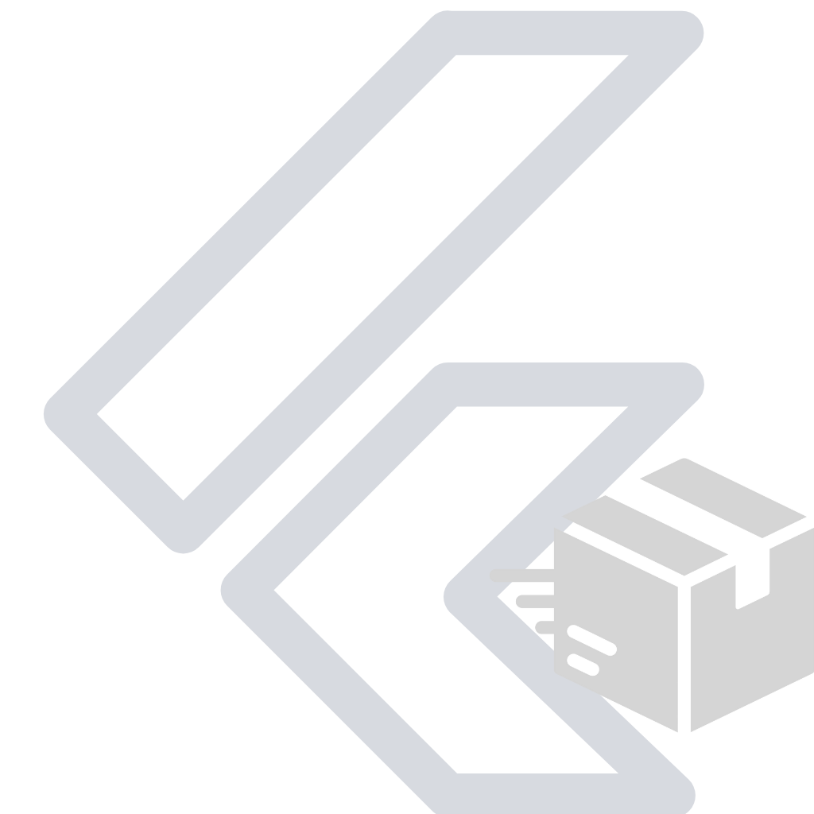

<div align="center">
<h1>


<b>Pub Studio</b>
</h1>

[](https://marketplace.visualstudio.com/items?itemName=Mastersam.pub-studio)
[](https://marketplace.visualstudio.com/items?itemName=Mastersam.pub-studio)

</div>

---

<br/>


---

Pub Studio is a Visual Studio Code extension designed to simplify the management of Flutter/Dart packages and plugins directly within the editor. This extension provides a seamless experience for developers, allowing them to manage dependencies, run scripts, and view package information without leaving the editor.

## Features

- **Scripts Management**: Easily run common Flutter and Dart scripts.
- **Actions**: Add, update, or remove dependencies with ease.
- **Dependencies**: View and manage your project's dependencies and dev dependencies.
- **Integrated Pubspec Management**: Navigate to dependency definitions within the `pubspec.yaml` file.

## Installation

To install Pub Studio:

1. Open Visual Studio Code.
2. Go to the Extensions view by clicking on the Extensions icon in the Sidebar.
3. Search for `Pub Studio`.
4. Click on the `Install` button.

## Usage

### Sidebar Views

Pub Studio adds an icon to the VS Code sidebar. Clicking on this icon will open the Pub Studio panel, which includes sections for Scripts, Actions, Dependencies, and Dev Dependencies.

#### Scripts

- **Flutter Clean**.
- **Static Analysis**.
- **Dart Fix**: Applies fixes with `dart fix --apply`.
- **Dart Format**.

#### Actions

- Installs all dependencies.
- Sort all dependencies.
- Remove unused dependencies.
- Add dependency(single or multiple).
- Add Dev Dependency(single or multiple).

#### Dependencies

- **View Dependencies**: Displays all project dependencies. Right-click on a dependency to update or remove it.
- **View Dev Dependencies**: Displays all dev dependencies. Right-click on a dev dependency to update or remove it.

## Commands

Pub Studio provides several commands accessible from the command palette (`Cmd+Shift+P` or `Ctrl+Shift+P`):

- `Pub Studio: Install All Dependencies`
- `Pub Studio: Sort All Dependencies`
- `Pub Studio: Remove Unused Dependencies`
- `Pub Studio: Add Dependency`
- `Pub Studio: Add Dev Dependency`
- `Pub Studio: Update Dependency`
- `Pub Studio: Remove Dependency`

## Custom Commands Support

Pub Studio now supports custom commands defined in your VS Code `settings.json`. These commands will appear in the Scripts section of the Pub Studio panel, allowing you to run them directly from VS Code.

### How to Use

1. Open your `settings.json` file in VS Code.
2. Add your custom commands under `pubStudio.customCommands`.

Example `settings.json`:
```json
{
    "pubStudio.customCommands": {
        "Run Custom Command 1": "echo Custom Command 1",
        "Run Custom Command 2": "echo Custom Command 2"
    }
}
```


## Configuration

No additional configuration is required. Pub Studio reads from your `pubspec.yaml` file to provide information about your dependencies and scripts.

## Demonstration

### Managing Dependencies

[](https://youtu.be/i3nR5dfxI78)

### Running Scripts

[](https://youtu.be/IiNp89YnDRg)

### Adding Dependencies

[](https://youtu.be/V0zHUy6oXKI)

## Contributing

Contributions are welcome! Please fork the repository and submit pull requests for any enhancements or bug fixes.

## Star Our Repository

If you find Pub Studio useful, please consider starring our repository on GitHub! Your support helps us continue to improve the extension.

[](https://github.com/Mastersam07/pub-studio/stargazers)

## License

This extension is licensed under the MIT License.

---

For detailed documentation and contribution guidelines, please visit the [GitHub repository](https://github.com/Mastersam07/pub-studio).
